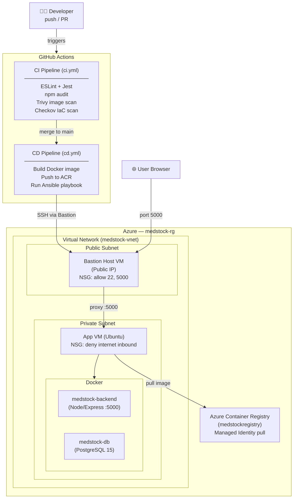

# 💊 MedStock Monitor

> **Empowering local pharmacies with real-time inventory visibility and automated stock alerts.**

---

## Live Application

| | URL |
|---|---|
| Live App | `http://<BASTION_PUBLIC_IP>:5000` *(update after deployment)* |
| Health Check | `http://<BASTION_PUBLIC_IP>:5000/health` |
| GitHub Repository | https://github.com/PaulRwagasana/MedStock-Monitor |
| GitHub Projects Board | https://github.com/users/PaulRwagasana/projects/2 |

---

## Problem Statement

Many community pharmacies across Africa still manage medicine inventory using paper records or disconnected spreadsheets. These manual processes often lead to inaccurate stock records, unexpected medicine shortages, delayed patient care, and inefficient inventory management.

**MedStock Monitor** is a lightweight inventory management system designed to help pharmacies digitally monitor medicine stock levels, update inventory in real time, and identify medicines that require restocking before shortages occur.

---

## Architecture Diagram



**Traffic flow:**
1. User browser → Bastion Host public IP (port 5000)
2. Bastion → App VM private IP (SSH for Ansible, app traffic on port 5000)
3. App VM → ACR (pull image via Managed Identity)
4. App container → Postgres container (Docker internal network)

---

## Technology Stack

| Layer | Technology |
|-------|------------|
| Backend | Node.js (Express) |
| Frontend | HTML, CSS, JavaScript |
| Database | PostgreSQL 15 |
| Containerization | Docker & Docker Compose |
| Container Registry | Azure Container Registry (ACR) |
| Infrastructure | Terraform (Azure provider) |
| Configuration Management | Ansible |
| CI/CD | GitHub Actions |
| Security Scanning | Trivy (images), Checkov (IaC), npm audit (dependencies) |
| Version Control | Git & GitHub |

---

## Project Structure

```text
MedStock-Monitor/
│
├── backend/
│   ├── src/
│   │   ├── config/db.js               # PostgreSQL connection pool
│   │   ├── controllers/medicineController.js
│   │   ├── middlewares/errorHandler.js
│   │   ├── models/medicineModel.js    # SQL queries
│   │   ├── routes/medicineRoutes.js
│   │   ├── services/medicineService.js
│   │   ├── utils/stockChecker.js
│   │   └── __tests__/Medicine.test.js
│   ├── migrations/001_create_tables.sql
│   ├── app.js
│   ├── server.js
│   └── package.json
├── frontend/
│   ├── index.html
│   ├── style.css
│   └── script.js
├── terraform/
│   ├── azure/                         # Cloud infrastructure (Summative)
│   │   ├── main.tf
│   │   ├── variables.tf
│   │   ├── outputs.tf
│   │   ├── providers.tf
│   │   ├── versions.tf
│   │   └── modules/
│   │       ├── network/
│   │       ├── bastion/
│   │       ├── compute/
│   │       ├── db/
│   │       └── registry/
│   ├── main.tf                        # Docker provider (local dev)
│   ├── compute.tf
│   ├── variables.tf
│   ├── outputs.tf
│   └── versions.tf
├── ansible/
│   ├── site.yml                       # Main playbook
│   ├── inventory.ini
│   ├── ansible.cfg
│   ├── requirements.yml
│   └── group_vars/all.yml
├── .github/
│   └── workflows/
│       ├── ci.yml                     # CI — lint, test, scan
│       └── cd.yml                     # CD — build, push, deploy
├── Dockerfile
├── docker-compose.yml
├── .env.example
├── .checkov.yaml
├── .trivyignore
├── .dockerignore
├── CHANGELOG.md
├── SECURITY.md
└── README.md
```

---

## How to Run the Application

### Option 1 — Docker Compose (Recommended for local development)

**Prerequisites:** Docker, Docker Compose

```bash
git clone https://github.com/PaulRwagasana/MedStock-Monitor
cd MedStock-Monitor
cp .env.example .env        # fill in your values
docker compose up --build
```

The app will be available at `http://localhost:5000`. PostgreSQL starts automatically.

> Never commit your `.env` file — it is listed in `.gitignore`.

### Option 2 — Run Locally (Without Docker)

**Prerequisites:** Node.js v20+, PostgreSQL running locally

```bash
git clone https://github.com/PaulRwagasana/MedStock-Monitor
cd MedStock-Monitor/backend
cp ../.env.example .env     # fill in your local DB credentials
npm install
npm start
```

Run the migration:

```bash
psql -U <your_db_user> -d <your_db_name> -f migrations/001_create_tables.sql
```

### Option 3 — Terraform + Ansible (Production deployment on Azure)

**Prerequisites:** Terraform >= 1.5.0, Ansible, Azure CLI authenticated

```bash
# 1. Provision infrastructure
cd terraform/azure
terraform init
terraform plan
terraform apply

# 2. Configure the VM and deploy the app
cd ../../ansible
ansible-playbook -i inventory.ini site.yml
```

---

## Access the Application

| Interface | URL |
|-----------|-----|
| Frontend dashboard | `http://localhost:5000` |
| All medicines | `http://localhost:5000/api/medicines` |
| Single medicine | `http://localhost:5000/api/medicines/:id` |
| Low stock alerts | `http://localhost:5000/api/medicines/alerts/low-stock` |
| Health check | `http://localhost:5000/health` |

---

## API Endpoints

| Method | Endpoint | Description |
|--------|----------|-------------|
| GET | `/health` | App and database health status |
| GET | `/api/medicines` | Retrieve all medicines |
| GET | `/api/medicines/search?name=` | Search medicines by name |
| GET | `/api/medicines/alerts/low-stock` | Medicines below their threshold |
| GET | `/api/medicines/category/:category` | Medicines by category |
| GET | `/api/medicines/:id` | Single medicine by ID |
| POST | `/api/medicines` | Add a new medicine |
| PUT | `/api/medicines/:id` | Update a medicine record |
| DELETE | `/api/medicines/:id` | Delete a medicine |
| PATCH | `/api/medicines/:id/add-stock` | Increase stock (`{ "amount": 10 }`) |
| PATCH | `/api/medicines/:id/reduce-stock` | Decrease stock (`{ "amount": 5 }`) |

### Example: Health Check

```bash
curl http://localhost:5000/health
# {"status":"ok","db":"connected"}
```

### Example: Add Stock

```bash
curl -X PATCH http://localhost:5000/api/medicines/1/add-stock \
  -H "Content-Type: application/json" \
  -d '{"amount": 10}'
```

### Example: Search

```bash
curl http://localhost:5000/api/medicines/search?name=para
```

---

## Environment Variables

Copy `.env.example` to `.env` and fill in your values:

| Variable | Description | Example |
|----------|-------------|---------|
| `DB_HOST` | PostgreSQL host | `localhost` or `db` (Docker) |
| `DB_PORT` | PostgreSQL port | `5432` |
| `DB_USER` | Database user | `postgres` |
| `DB_PASSWORD` | Database password | `yourpassword` |
| `DB_NAME` | Database name | `medstock` |
| `PORT` | API server port | `5000` |

---

## CI/CD Pipeline

### CI — runs on every push and PR to `main`

| Job | What it does |
|-----|-------------|
| `lint-and-test` | ESLint + Jest with coverage (Node 20 & 22 matrix) |
| `security-scan` | `npm audit --audit-level=high` |
| `iac-scan` | Checkov scans `terraform/` for misconfigurations |
| `docker-build` | Builds image, scans with Trivy (fails on CRITICAL/HIGH), pushes to GHCR |

### CD — runs on merge to `main`

| Job | What it does |
|-----|-------------|
| `lint-and-test` | Re-runs all CI checks |
| `security-scan` | Re-runs npm audit |
| `iac-scan` | Re-runs Checkov |
| `build-and-push` | Builds Docker image, Trivy scan, pushes to ACR |
| `deploy` | Runs Ansible playbook via Bastion SSH — pulls new image, restarts service |

---

## Infrastructure (Terraform — Azure)

All cloud resources are provisioned via `terraform/azure/`. The configuration is modular:

| Module | Resources provisioned |
|--------|----------------------|
| `network` | VNet, public subnet, private subnet, NSGs |
| `bastion` | Public IP, Bastion VM (Ubuntu 22.04), SSH NSG |
| `compute` | App VM (private subnet), NIC, Managed Identity |
| `db` | Azure Database for PostgreSQL (Flexible Server) |
| `registry` | Azure Container Registry, ACR pull role for App VM identity |

---

## Configuration Management (Ansible)

The `ansible/site.yml` playbook runs against the App VM and:

1. Installs Docker and required packages
2. Configures UFW firewall (allow SSH + port 5000, deny all other inbound)
3. Hardens SSH (disables root login and password authentication)
4. Enables fail2ban
5. Logs in to GHCR
6. Creates Docker network
7. Starts PostgreSQL container
8. Deploys MedStock Monitor container (pulls latest image)
9. Waits for `/health` to return 200 before marking deployment complete

---

## Security

See [SECURITY.md](SECURITY.md) for the full findings log, remediation status, and accepted risks.

Key measures in place:
- Non-root `node` user in Docker image
- OS packages upgraded at image build time
- Bundled `npm` CLI removed from production image (resolves `tar`/`brace-expansion` CVEs)
- Trivy image scan — pipeline fails on unresolved CRITICAL/HIGH CVEs
- Checkov IaC scan — pipeline fails on critical misconfigurations
- `npm audit` scoped to production dependencies
- Private subnet for App VM — no direct internet inbound
- SSH root login and password authentication disabled on VM
- Managed Identity for ACR pull (no stored credentials)

---

## Sample Medicine Dataset

| Name | Category | Initial Qty | Threshold |
|------|----------|-------------|-----------|
| Paracetamol | Analgesics | 120 | 20 |
| Amoxicillin | Antibiotics | 30 | 15 |
| Coartem | Antimalarials | 8 | 10 |
| Ibuprofen | Analgesics | 65 | 20 |
| Metformin | Diabetes | 40 | 15 |

---

## Usage

### View All Medicines
Open `http://localhost:5000` in your browser to see the full inventory dashboard.

### Search a Medicine
Type a medicine name in the search bar to filter results in real time.

### Add a Medicine
Click **Add Medicine**, fill in the form, and click **Add Medicine** to save.

### Adjust Stock
Enter a positive number (e.g. `10`) to increase stock or use the reduce option with a positive number (e.g. `5`) to decrease stock, then click **Update**.

### Delete a Medicine
Click **Delete** on any row and confirm to remove it from inventory.

### View Low Stock
Click **Low Stock** in the sidebar to see all medicines below their minimum threshold.

---

## Team

| Member | Role |
|--------|------|
| Paul Rwagasana | DevOps Lead — CI/CD pipelines, repository setup, branch protection |
| Mika Rurangwa | Backend Developer — Express API, PostgreSQL, Ansible |
| Monica Akoi Dau Ahol | Frontend & Documentation — UI, README, CHANGELOG, architecture diagram |
| Cletus Ayeebo Abugre | Infrastructure & Security — Terraform compute, Docker security, IaC scanning |
| Munezero Hubert | Infrastructure — Azure credentials, networking, ACR |

### Team Collaboration
- GitHub Projects (Kanban) for task management
- Feature branches for all development work
- Pull Requests required for merging into `main`
- Branch protection enforced on `main`
- Code review required before merge

---

## Links

- [GitHub Projects Board](https://github.com/users/PaulRwagasana/projects/2)
- [Team Participation Sheet](https://docs.google.com/spreadsheets/d/1blNfxmnIE4V08rAdkrFbVRxIW0tneXAPW_wd-nVdoM0/edit?gid=0#gid=0)
- [CHANGELOG](CHANGELOG.md)
- [SECURITY.md](SECURITY.md)

---

## License

This project is licensed under the [MIT License](LICENSE).
